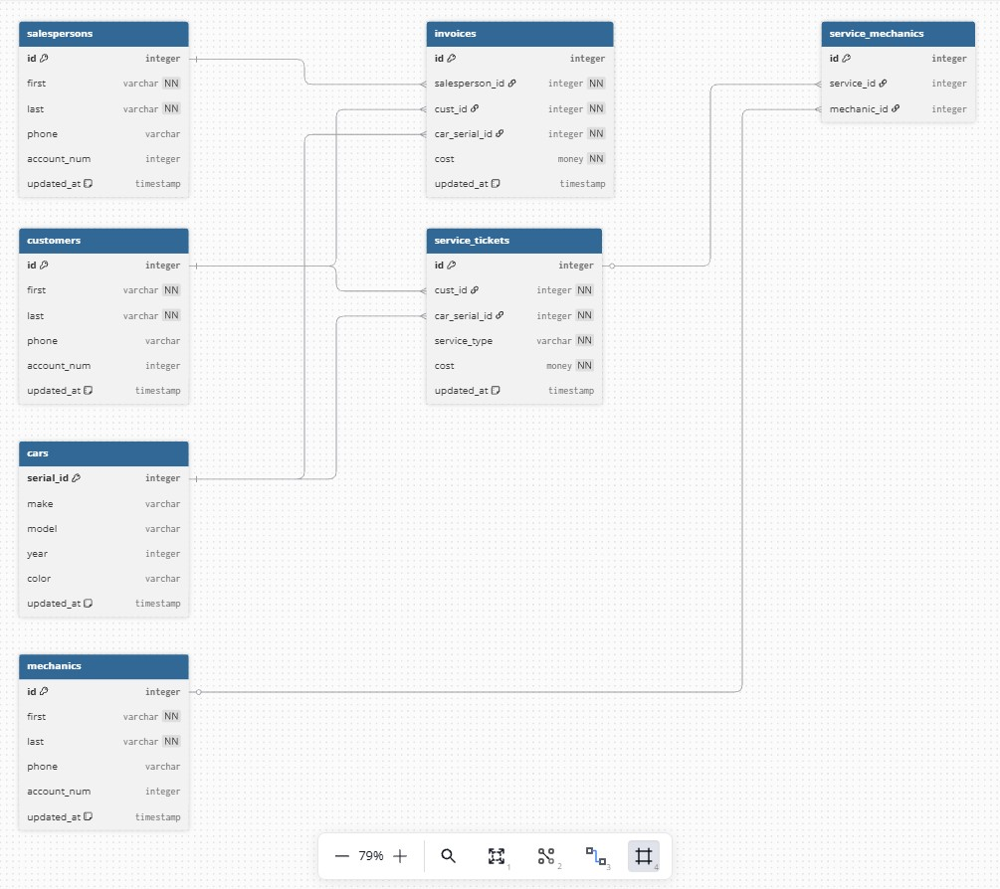

# Database Design and Creation

---

## Car Dealership

As a group (if you like), create an ERD for a car dealership. The dealership sells both new and used cars, and it operates a service facility. Base your design on the following business rules:

1.  A salesperson may sell many cars, but each car is sold by only one salesperson.

2.  A customer may buy many cars, but each car is purchased by only one customer.

3.  A salesperson writes a single invoice for each car he or she sells.

4.  A customer gets an invoice for each car he or she buys.

5.  A customer may come in just to have his or her car serviced; that is, a customer need not buy a car to be classified as a customer.

6.  A customer can repeatedly use the maintenance facility for their for repairs or service, one service ticket is written for each car.

7.  The car dealership maintains a service history for each of the cars serviced. The service  records are referenced by the car's serial number.

8.  A car brought in for service can be worked on by many mechanics, and each mechanic may work on many cars.

Once you have designed the ERD; SOLO - Create a SQLite database, and use DDL (Data Definition Language) to create the Tables in accordance with your ERD.

Once you have created all the tables, populate each table with at least 5 records.

---

## Created schema based on prompt:

